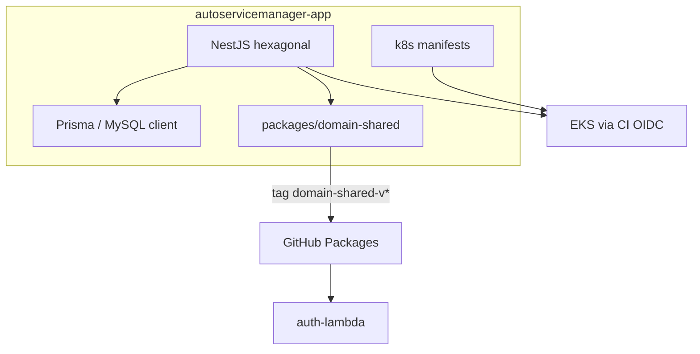

# autoservicemanager-app

Backend NestJS (hexagonal) para gestão de oficina mecânica — **Fase 3**: deploy em **EKS**, autenticação cliente via API Gateway + Lambda `authCpf` (JWT **RS256**), **RDS MySQL** (Prisma), **CloudWatch/X-Ray**.

Este é o repositório **app** pós-cisão (código Nest + `packages/domain-shared` + manifests `k8s/` + docs canônicos). Spec-Skills permanece aqui (`AGENTS.md`).

| Unidade irmã | Repo |
|--------------|------|
| Lambda auth CPF | [autoservicemanager-auth-lambda](https://github.com/dinhogt/autoservicemanager-auth-lambda) |
| Terraform VPC + RDS | [autoservicemanager-infra-db](https://github.com/dinhogt/autoservicemanager-infra-db) |
| Terraform EKS / APIGW / obs | [autoservicemanager-infra-k8s](https://github.com/dinhogt/autoservicemanager-infra-k8s) |
| Validações CPF/CNPJ/placa | [`packages/domain-shared/`](packages/domain-shared/) → GitHub Packages (`@dinhogt/domain-shared`) |

| Doc | Link |
|-----|------|
| Release notes | [docs/release-notes.md](docs/release-notes.md) |
| Solution design Fase 3 | [docs/architecture/solution-design-fase3.md](docs/architecture/solution-design-fase3.md) |
| Diagramas / ER / riscos | [diagramas](docs/architecture/diagrams-fase3.md) · [ER](docs/architecture/er-diagram.md) · [riscos](docs/architecture/risk-map-fase3.md) |
| Runbook | [docs/runbook.md](docs/runbook.md) |
| Contrato API | [docs/backend/api-contract.md](docs/backend/api-contract.md) |
| Observabilidade | [docs/observability/](docs/observability/) |
| Segurança | [docs/security/SECURITY.md](docs/security/SECURITY.md) |

## Escopo neste repo



## Estrutura

```
autoservicemanager-app/
├── src/                      # App NestJS (hexagonal)
│   ├── domain/
│   ├── application/
│   ├── infrastructure/
│   ├── interfaces/http/
│   └── shared/               # Reexports domain-shared
├── packages/domain-shared/   # CPF/CNPJ/placa (Yarn workspace + Packages)
├── k8s/                      # Manifestos EKS (+ local/ kind)
├── prisma/
├── scripts/
├── docs/                     # ADRs, RFCs, ER, obs, QA (canônicos)
├── AGENTS.md                 # Spec-Skills
└── .github/workflows/        # ci-cd, security-gate, publish-domain-shared
```

Bounded contexts: **atendimento**, **autenticacao**, **cadastro**, **catalogo-servicos**, **estoque**.

## Pré-requisitos

- Node.js **22**, Yarn, MySQL (`DATABASE_URL`)

## Configuração e execução

```bash
yarn install
cp .env.example .env
yarn db:generate
yarn db:migrate
yarn start:dev
```

| Script | Descrição |
|--------|-----------|
| `yarn lint` / `yarn test` / `yarn test:cov` | Qualidade |
| `yarn arch:check` | Boundaries hexagonais |
| `yarn domain-shared:build` / `:test` | Pacote compartilhado |
| `yarn build` / `yarn start:prod` | Produção |

Variáveis: ver `.env.example` e `src/infrastructure/config/env.validation.ts`. Seed: `yarn db:seed` (senha demo `Senha@1234` — altere em produção).

## Autenticação

- **Admin:** `POST /auth/login` → JWT HS256; rotas `/admin/*`
- **Cliente:** `POST /auth/cpf` no API Gateway → [auth-lambda](https://github.com/dinhogt/autoservicemanager-auth-lambda); Authorizer injeta `x-cpf` / `x-scope`

## Documentação da API (Swagger)

- **Swagger UI**: `GET /api-docs` (ex.: http://localhost:3000/api-docs) — off em production salvo `SWAGGER_ENABLED=true`
- **OpenAPI JSON**: `GET /api-docs-json`
- **Postman**: [`docs/postman/autoservicemanager.postman_collection.json`](docs/postman/autoservicemanager.postman_collection.json)

## domain-shared → GitHub Packages

1. Bump versão em `packages/domain-shared/package.json`
2. Push tag `domain-shared-v0.1.0` (ou `workflow_dispatch` em [`publish-domain-shared.yml`](.github/workflows/publish-domain-shared.yml))
3. Pacote `@dinhogt/domain-shared` fica disponível em `npm.pkg.github.com`
4. [auth-lambda](https://github.com/dinhogt/autoservicemanager-auth-lambda) consome com `NODE_AUTH_TOKEN` / `GITHUB_TOKEN` (`packages:read`)

> GitHub Packages exige escopo npm = owner do repo (`@dinhogt/...`). O plano FIAP citava `@autoservicemanager/domain-shared` como nome lógico.

## CI/CD

| Workflow | Escopo |
|----------|--------|
| [`.github/workflows/ci-cd.yml`](.github/workflows/ci-cd.yml) | `security-gate` → lint, arch, test:cov, build, docker; CD OIDC → ECR → migrate → EKS |
| [`security-gate.yml`](.github/workflows/security-gate.yml) | Audit + secret scan |
| [`publish-domain-shared.yml`](.github/workflows/publish-domain-shared.yml) | Tag `domain-shared-v*` → Packages |

Sem path filters de monorepo. `develop` → homolog; `master` → production.

Governança: [docs/infrastructure/branch-protection.md](docs/infrastructure/branch-protection.md) · [ci-cd.md](docs/infrastructure/ci-cd.md).

## Deploy (ordem Fase 3)

1. [infra-db](https://github.com/dinhogt/autoservicemanager-infra-db) apply  
2. [infra-k8s](https://github.com/dinhogt/autoservicemanager-infra-k8s) apply  
3. auth-lambda CD  
4. este app CD  

Runbook: [docs/runbook.md](docs/runbook.md).

## Documentação complementar

| Área | Links |
|------|-------|
| ADRs Fase 3 | [004](docs/architecture/adr-004-api-gateway-vpc-link.md)–[010](docs/architecture/adr-010-discontinue-mongodb-audit.md) |
| RFCs | [001](docs/architecture/rfc-001-cloud-aws.md) · [002](docs/architecture/rfc-002-mysql-rds.md) · [003](docs/architecture/rfc-003-auth-lambda-rs256.md) |
| Backend | [repo-app](docs/backend/repo-app.md) · [auth-lambda](docs/backend/auth-lambda.md) · [domain-shared](docs/backend/domain-shared-package.md) |
| Infra | [repo-infra-db](docs/infrastructure/repo-infra-db.md) · [repo-infra-k8s](docs/infrastructure/repo-infra-k8s.md) |
| QA | [validation](docs/qa/validation-report.md) · [regression](docs/qa/regression-report.md) |
| Spec-Skills | [`AGENTS.md`](AGENTS.md) · [`spec-skills-lib/`](spec-skills-lib/) |
