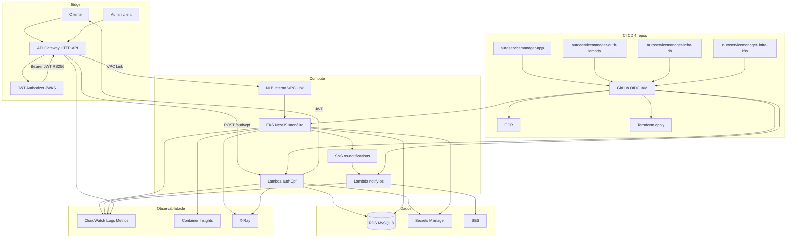
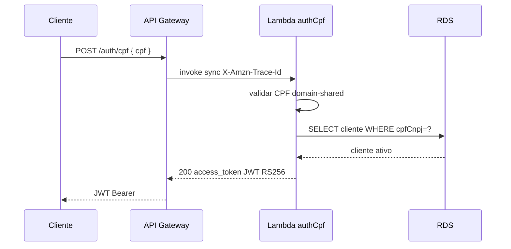
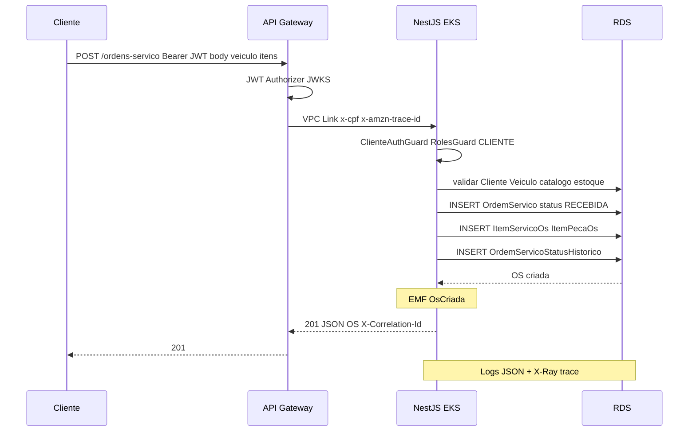
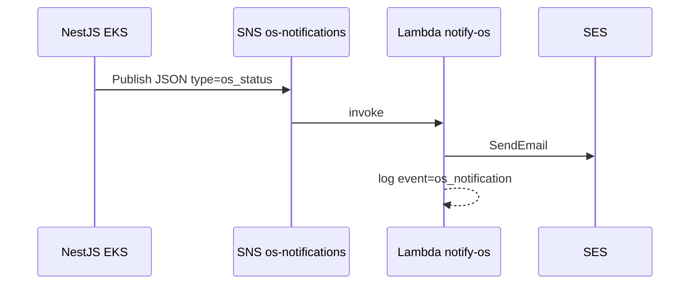
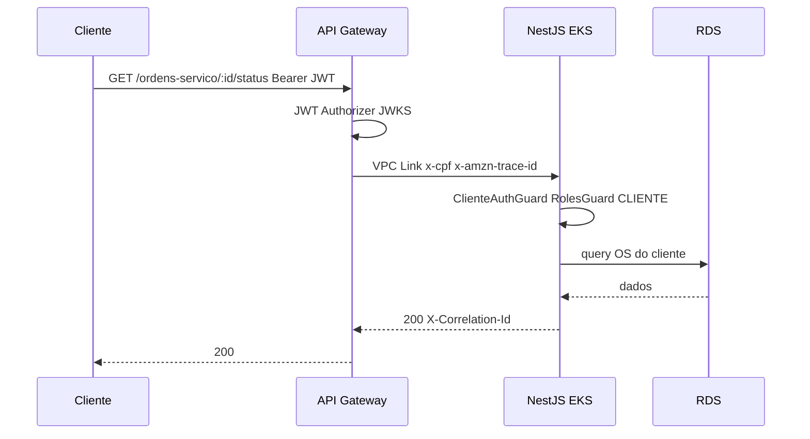
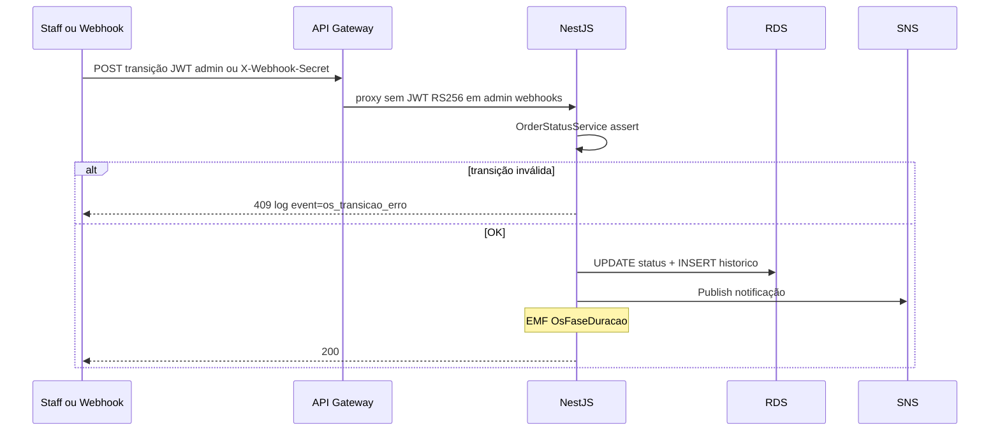

# Diagramas — Fase 3

| Campo | Valor |
|-------|-------|
| Todo | `docs-diagrams` |
| Data | 2026-09-06 |
| Fonte | [solution-design-fase3.md](./solution-design-fase3.md) |
| Repos | app · auth-lambda · infra-db · infra-k8s (pós-cisão) |

## Componentes (nuvem, APIs, banco, monitoramento)

Visão pós-cisão: quatro repositórios GitHub com CI/CD OIDC; runtime AWS (API Gateway, Lambda, EKS, RDS); observabilidade nativa (CloudWatch, Container Insights, X-Ray).

## Sequência — autenticação CPF

## Sequência — abertura de ordem de serviço (POST)

Fluxo obrigatório da rubrica: cliente autenticado abre OS (`POST /ordens-servico`).

## Sequência — notificação serverless (status OS)

## Sequência — consulta OS protegida (cliente)

## Sequência — transição de status (admin / webhook)

## PNG

Exportar estes Mermaid no viewer (GitHub / mermaid.live) se o PDF da entrega exigir imagem raster — fontes canônicas são os blocos acima.
