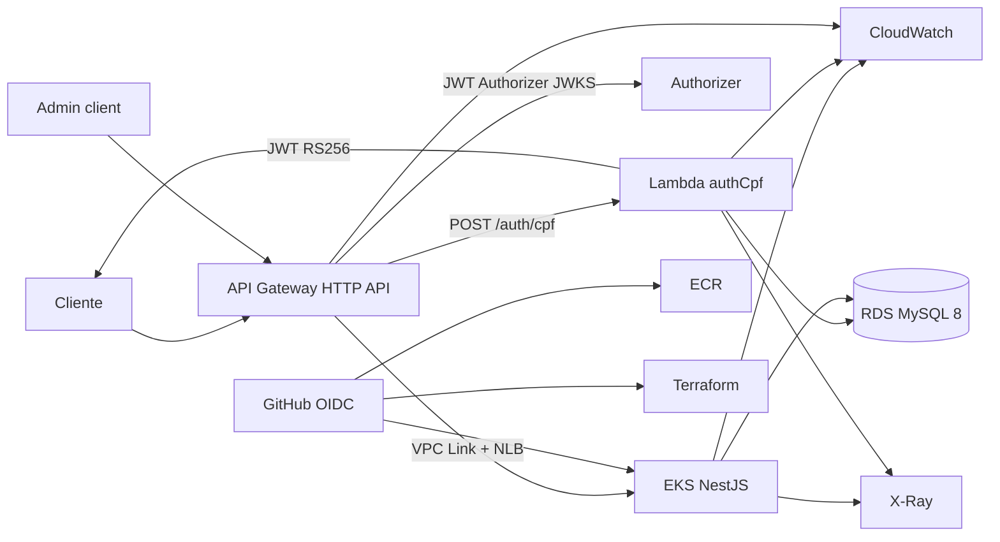
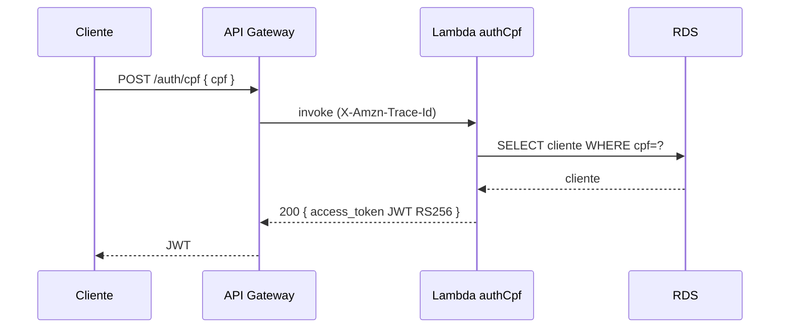
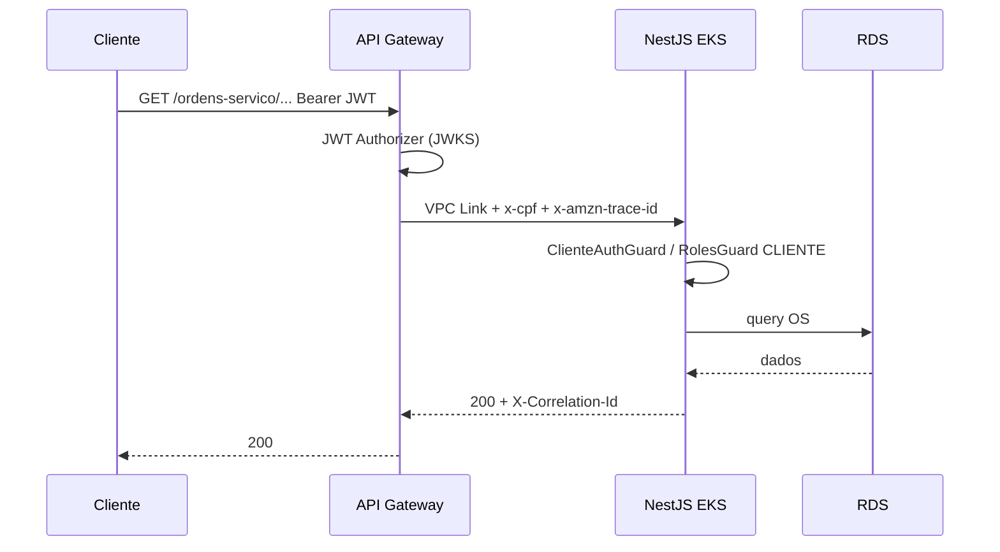
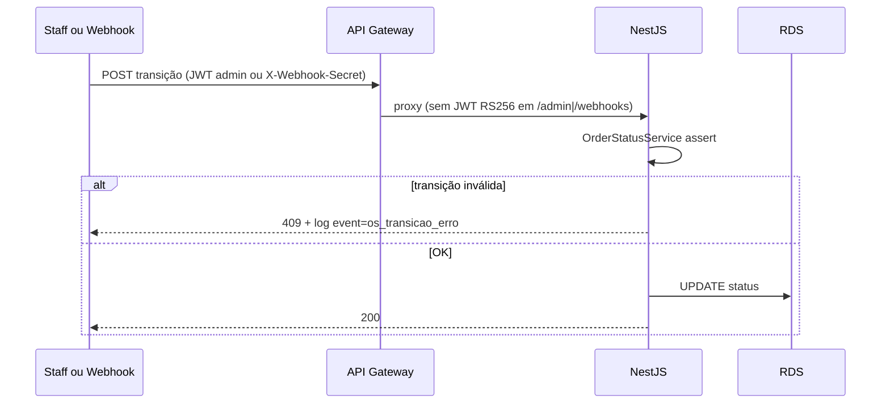

# Diagramas — Fase 3

| Campo | Valor |
|-------|-------|
| Todo | `docs-arch` |
| Data | 2026-08-09 |
| Fonte | [solution-design-fase3.md](./solution-design-fase3.md) |

## Componentes

## Sequência — autenticação CPF

## Sequência — OS protegida (cliente)

## Sequência — transição de status (admin / webhook)

## PNG

Exportar estes Mermaid no viewer (GitHub / mermaid.live) se o PDF da entrega exigir imagem raster — fontes canônicas são os blocos acima.
