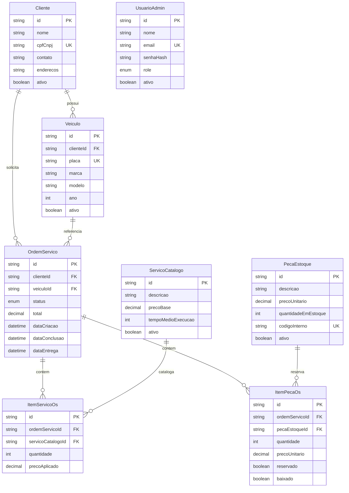

# Diagrama ER — MySQL (Prisma)

| Campo | Valor |
|-------|-------|
| Todo | `docs-arch` |
| Data | 2026-08-09 |
| Fonte | [`prisma/schema.prisma`](../../prisma/schema.prisma) |
| Nota | Sem coleções Mongo (ADR-010) |

## Enums

| Enum | Valores |
|------|---------|
| `StatusOs` | RECEBIDA, EM_DIAGNOSTICO, AGUARDANDO_APROVACAO, EM_EXECUCAO, FINALIZADA, ENTREGUE, REJEITADA |
| `RoleAdmin` | ADMIN, GERENTE, MECANICO, ATENDENTE |

`UsuarioAdmin` não tem FK para OS (auth admin desacoplada do domínio de atendimento).
