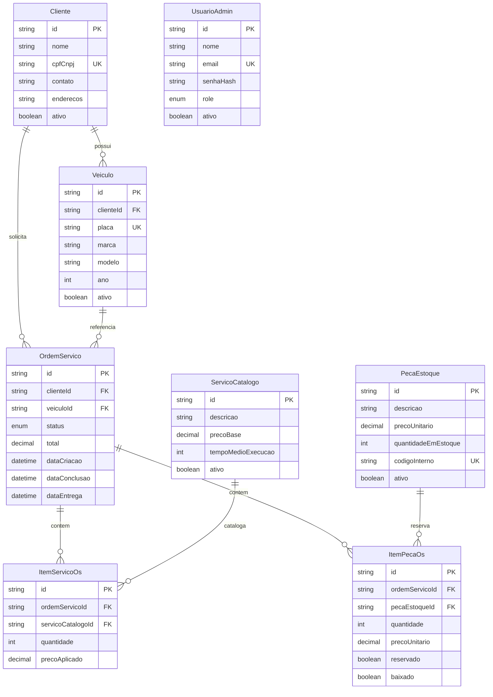

# Diagrama ER — MySQL (Prisma)

| Campo | Valor |
|-------|-------|
| Todo | `docs-er-narrative` |
| Data | 2026-09-06 |
| Fonte | [`prisma/schema.prisma`](../../prisma/schema.prisma) |
| Justificativa formal | [RFC-002](./rfc-002-mysql-rds.md) · [ADR-010](./adr-010-discontinue-mongodb-audit.md) |
| Nota | Sem coleções Mongo (ADR-010) |

## Justificativa do modelo relacional

A oficina exige **consistência forte** na abertura e transição de OS (cliente, veículo, itens de serviço/peça, estoque e totais monetários no mesmo ciclo). Por isso a fonte da verdade transacional é **MySQL 8 em RDS** com **Prisma**:

| Critério | Como o modelo atende |
|----------|----------------------|
| ACID | `INSERT` de OS + itens em transação; reserva/baixa de peça coerente com status |
| Integridade referencial | FKs `Cliente`→`Veiculo`/`OrdemServico`; itens → catálogo/estoque |
| Precisão monetária | `Decimal` em preços e `total` da OS |
| Operação cloud | RDS gerenciado, TLS, Secrets Manager (RFC-002); migrações via Job K8s |
| Auditoria | Eventos e correlação em CloudWatch (não Mongo) — ADR-010 |

Alternativas rejeitadas (detalhe na RFC-002): MySQL self-managed, Aurora (custo), dual-write MySQL+Mongo.

## Diagrama ER

## Relacionamentos (prosa)

| Relação | Cardinalidade | Significado |
|---------|---------------|-------------|
| Cliente → Veiculo | **1:N** | Um cliente possui zero ou mais veículos; cada veículo pertence a um único cliente (`clienteId`). |
| Cliente → OrdemServico | **1:N** | O cliente solicita várias OS ao longo do tempo; a OS guarda `clienteId` para autorização (`x-cpf`) e histórico. |
| Veiculo → OrdemServico | **1:N** | Várias OS podem referenciar o mesmo veículo em datas distintas; abertura exige veículo do mesmo cliente. |
| OrdemServico → ItemServicoOs | **1:N** | Linhas de serviço da OS; cada item aponta para `ServicoCatalogo` (preço aplicado pode divergir do base). |
| OrdemServico → ItemPecaOs | **1:N** | Linhas de peça; flags `reservado`/`baixado` amarram ciclo de estoque à OS. |
| ServicoCatalogo → ItemServicoOs | **1:N** | Catálogo reutilizável; desativar serviço não apaga histórico de itens. |
| PecaEstoque → ItemPecaOs | **1:N** | Estoque central; quantidade em estoque é atualizada conforme reserva/baixa. |
| UsuarioAdmin | isolado | Sem FK para OS: autenticação admin (JWT HS256) desacoplada do domínio de atendimento. |

Fluxo típico de abertura: validar Cliente + Veiculo → criar `OrdemServico` com `status = RECEBIDA` → gravar itens → persistir `total`. Transições posteriores (diagnóstico → execução → finalização) atualizam o enum `StatusOs` sem quebrar FKs.

## Enums

| Enum | Valores |
|------|---------|
| `StatusOs` | RECEBIDA, EM_DIAGNOSTICO, AGUARDANDO_APROVACAO, EM_EXECUCAO, FINALIZADA, ENTREGUE, REJEITADA |
| `RoleAdmin` | ADMIN, GERENTE, MECANICO, ATENDENTE |

`UsuarioAdmin` não tem FK para OS (auth admin desacoplada do domínio de atendimento).
