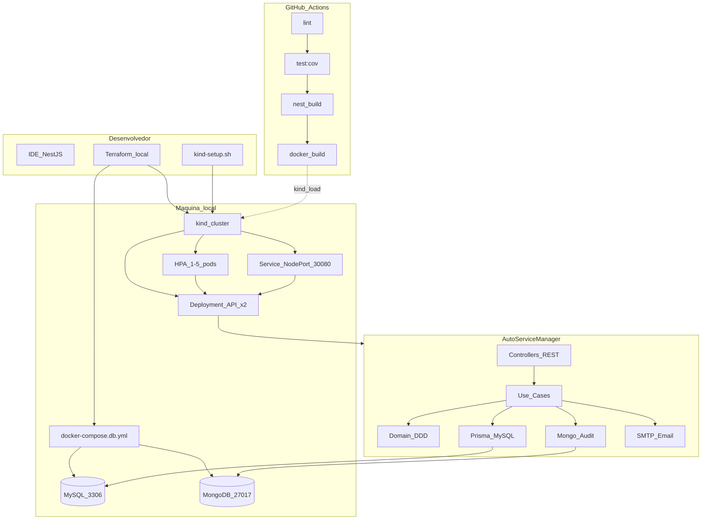
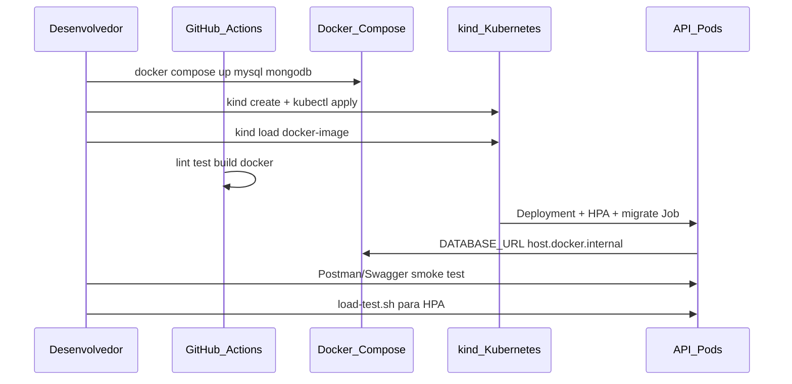

# Diagrama de arquitetura — Fase 2 (ambiente local)

Ambiente de demonstração: **Kubernetes local (kind)** + **Docker Compose (DB)** + **CI GitHub Actions**.

## Visão geral

## Fluxo de deploy (demo)

## APIs críticas Fase 2

| API | Método | Autenticação |
|-----|--------|--------------|
| Abertura OS | `POST /ordens-servico` | Pública |
| Status OS | `GET /ordens-servico/:id/status` | CPF/placa |
| Aprovação orçamento | `POST /ordens-servico/:id/aprovacoes` | CPF/placa |
| Listagem admin | `GET /admin/ordens-servico` | JWT |
| Webhook status | `POST /webhooks/os/:id/status` | X-Webhook-Secret |
| E-mail | Side effect em transições | SMTP |

## Path alternativo (cloud)

Para produção acadêmica alternativa, ver [`solution-design.md`](./solution-design.md) e [`../runbook-deploy-eks.md`](../runbook-deploy-eks.md): AWS EKS + RDS + ECR via [`../../infra/terraform/environments/dev/`](../../infra/terraform/environments/dev/).

## Componentes por pasta

| Pasta | Conteúdo |
|-------|----------|
| `src/domain/` | Entidades, regras, ports |
| `src/application/` | Use cases |
| `src/infrastructure/` | Prisma, Mongo, e-mail, auth |
| `src/interfaces/http/` | Controllers REST |
| `k8s/local/` | Manifestos kind |
| `infra/terraform/local/` | Cluster kind + compose DB |
| `.github/workflows/ci-cd.yml` | Pipeline CI (+ CD AWS opcional) |
