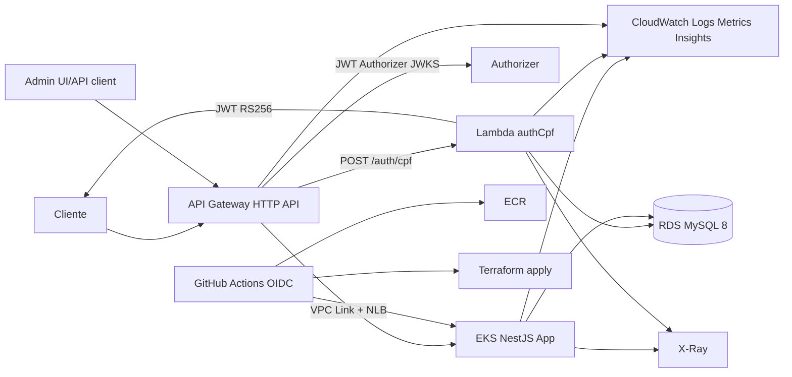

# Solution Design — Fase 3 AutoServiceManager

| Campo | Valor |
|-------|-------|
| Role | architecture (`.agents/skills/role-architecture`) |
| Workflow | `.agents/workflows/design-architecture-security.md` |
| Stack | `nestjs-next-react` / AWS (Uso Excepcional — governance) |
| Baseline | [solution-design.md](./solution-design.md) (Fase 2) |
| Handoff | **next_role: `backend` / `infrastructure`** — `gate-security-review` **PASS** ([threat-model.md](../security/threat-model.md)) |

## Visão geral

Elevar o monólito NestJS hexagonal a operação corporativa: **API Gateway + Lambda auth CPF (JWT RS256)**, **EKS**, **RDS MySQL gerenciado**, **Terraform em dois repos**, **CI/CD OIDC**, **CloudWatch + X-Ray**, **sem MongoDB**. Aplicação permanece monólito modular; a segregação é de **repositórios e pipeline**, não de microserviços de domínio.

## Diagrama de componentes

## Boundaries e contratos

| Boundary | Contrato | Confiança |
|----------|----------|-----------|
| Internet → API Gateway | HTTPS; `/auth/cpf` público; demais com Bearer | Edge |
| API Gateway → Lambda | Invoke sync; timeout curto | AWS |
| API Gateway → EKS | VPC Link / NLB; headers `x-cpf`, `x-amzn-trace-id` | Só tráfego do gateway |
| Lambda / EKS → RDS | TLS; SG restrito; credenciais Secrets Manager | Private subnets |
| App admin | JWT HS256 local + `RolesGuard` | Inalterado Fase 2 |
| App cliente | Claims já validadas no Authorizer | Sem revalidação de assinatura no Nest |
| Domínio compartilhado | Pacote [`@dinhogt/domain-shared`](../../packages/domain-shared/) — ver [domain-shared-package.md](../backend/domain-shared-package.md) | Yarn workspaces + GitHub Packages |
| Terraform db → k8s | `terraform_remote_state` outputs | ADR-008 |

## Escopo de autenticação (vs Fase 2)

- Rotas hoje públicas por CPF/placa passam a exigir **JWT de cliente** (ADR-007).
- Role lógico `CLIENTE` no gateway; roles admin inalteradas.
- Webhook (`X-Webhook-Secret`) permanece mecanismo separado (integração máquina).

## Repositórios

| Repo | Conteúdo |
|------|----------|
| `autoservicemanager-app` | NestJS, k8s manifests, Dockerfile hardened, publica `domain-shared` |
| `autoservicemanager-auth-lambda` | `authCpf`, esbuild, JWT RS256 |
| `autoservicemanager-infra-db` | Terraform VPC + RDS + Secrets (state `db/`) |
| `autoservicemanager-infra-k8s` | Terraform EKS/APIGW/Lambda/IRSA (consome remote_state db) |

## ADRs Fase 3

| ADR | Tema |
|-----|------|
| [ADR-004](./adr-004-api-gateway-vpc-link.md) | API Gateway + VPC Link + NLB |
| [ADR-005](./adr-005-hpa.md) | HPA no EKS |
| [ADR-006](./adr-006-structured-logs-correlation.md) | Logs JSON + correlação |
| [ADR-007](./adr-007-jwt-rs256-api-gateway-authorizer.md) | JWT RS256 + JWT Authorizer |
| [ADR-008](./adr-008-terraform-remote-state.md) | State remoto S3 + DynamoDB |
| [ADR-009](./adr-009-github-oidc-aws-iam.md) | GitHub OIDC → IAM |
| [ADR-010](./adr-010-discontinue-mongodb-audit.md) | Fim do Mongo; audit via CloudWatch |

RFCs: [001 AWS](./rfc-001-cloud-aws.md) · [002 RDS](./rfc-002-mysql-rds.md) · [003 Auth](./rfc-003-auth-lambda-rs256.md). Diagramas: [diagrams-fase3.md](./diagrams-fase3.md) · [er-diagram.md](./er-diagram.md) · [risk-map-fase3.md](./risk-map-fase3.md).

## NFR

| NFR | Abordagem |
|-----|-----------|
| Escalabilidade | HPA no EKS; Lambda sob demanda; RDS vertical em dev |
| Resiliência | Timeout APIGW 30s; endpoints síncronos &lt; 5s; Job migrate separado |
| Observabilidade | Container Insights, logs JSON, X-Ray, propagação `X-Amzn-Trace-Id` |
| Segurança | Authorizer no edge; OIDC CI; não-root; `security-gate` PASS ([threat-model.md](../security/threat-model.md)) |

## Mapa de riscos técnicos

| # | Risco | Impacto | Mitigação | ADR / todo |
|---|-------|---------|-----------|------------|
| R1 | Cold start Lambda authCpf | Médio | Aceitar; alarme p95 &gt; 2s | — |
| R2 | Custo AWS (EKS + RDS + NAT) | Médio | Destroy pós-demo; single-AZ; NAT único | ADR-002 |
| R3 | Drift regra CPF entre repos | Baixo | Pacote `domain-shared` | shared-package |
| R4 | Perda de correlação no VPC Link | Médio | Propagar `X-Amzn-Trace-Id` | observability |
| R5 | Breaking change rotas cliente | Alto | Documentar; demo com fluxo novo | ADR-007 |
| R6 | Rotação chave JWT RS256 | Médio | Duas chaves no JWKS (`kid`) | ADR-007 |
| R7 | Timeout 30s APIGW | Baixo | Design síncrono curto | — |
| R8 | `readOnlyRootFilesystem` quebrar writes | Médio | `emptyDir` `/tmp`; Job migrate | dockerfile-nonroot |
| R9 | Regressão fluxos críticos | Alto | F1–F7 + relatórios QA | docs/qa/* |
| R10 | Headers `x-cpf` forjados se NLB exposto | Alto | Só VPC Link; SG; T1 no threat model | security-gate (PASS; residual em infra) |
| R11 | State Terraform corrompido / apply paralelo | Médio | DynamoDB lock; ordem db→k8s | ADR-008 |
| R12 | Vazamento AKIA em CI | Alto | OIDC only | ADR-009 |

## Done criteria (ArchitectureSpec)

- [x] Arquitetura válida para nível de implementação (boundaries + ADRs irreversíveis)
- [x] Riscos e mitigações mapeados
- [x] Playbook / governança: AWS justificada; NestJS+Prisma+MySQL mantidos

## Handoff

- **next_todo:** `delivery-pdf`
- **next_role:** `documentation`
- **Artefatos docs-arch:** [docs-arch-handoff.md](./docs-arch-handoff.md)
- **Branch protection:** [../infrastructure/branch-protection.md](../infrastructure/branch-protection.md)
- **Próximo todo do plano:** `delivery-pdf`
