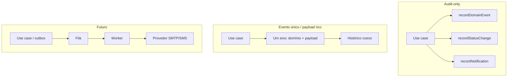

# Análise comparativa: fluxos de notificação (AutoServiceManager)

**Escopo:** comparar três linhas de evolução — **audit-only**, **evento de domínio como eixo único** e **fila + workers (futuro)** — e registrar **recomendações de desenho** sem implementar provedores, filas nem adaptadores de envio.

**Resumo executivo:** No MVP, “notificação” no Mongo é **registro de intenção** (auditoria), não entrega externa. As três opções diferem por **redundância semântica**, **complexidade operacional** e **preparação para canais reais**. Para o curto prazo, manter audit-only é coerente, desde que o glossário evento ↔ notificação pretendida fique explícito; unificar significados reduz ruído no histórico; fila e outbox são para quando houver SLA de entrega ou compliance.

Este documento compara abordagens para representar “avisar o cliente” e trilhas relacionadas, **sem implementar canais reais** (e-mail, SMS, push). Serve de base para decisões de evolução alinhadas ao MVP atual (NestJS, MySQL como verdade, Mongo em modo best-effort para auditoria).

### Mapeamento aos três fluxos do plano de revisão

| Fluxo no plano | Seção neste documento |
|----------------|-------------------------|
| MVP **audit-only** (`recordNotification` como intenção) | §2.1 |
| **Unificar com eventos de domínio** (um fato, menos gravações paralelas) | §2.2 |
| **Evolução futura:** fila (BullMQ/SQS etc.) + workers; opcional **transactional outbox** no MySQL | §2.3 |

---

## 1. Contexto no código hoje

- **Persistência transacional:** estado da ordem de serviço em MySQL (Prisma).
- **Auditoria complementar:** contrato `OsMongoAuditPort` em `src/domain/atendimento/ports/os-mongo-audit.port.ts` com três operações: `recordDomainEvent`, `recordStatusChange`, `recordNotification`. A implementação Mongo usa `bestEffort()` — falhas de escrita não revertem a transação SQL.
- **Eventos de domínio nomeados:** `OsDomainEventType` em `src/domain/atendimento/events/os-domain-events.ts` (ex.: `OrcamentoGerado`, `OrcamentoEnviadoParaCliente`).
- **Exemplo concreto:** em `GerarOrcamentoUseCase` (`src/application/atendimento/use-cases/gerar-orcamento.use-case.ts`), após persistir a OS, o fluxo chama em sequência `recordDomainEvent` (`OrcamentoGerado`), `recordStatusChange` e `recordNotification` com `kind` igual a `OrcamentoEnviadoParaCliente`, canal `internal` e mensagem alinhada ao MVP sem e-mail — três gravações de auditoria para um mesmo passo de negócio.

Ou seja, hoje **“notificação” no Mongo é principalmente intenção / registro legível**, não entrega externa.

---

## 2. Opções comparadas

### 2.1 MVP audit-only (manter registro explícito de notificação)

**Ideia:** Continuar usando `recordNotification` como registro de **intenção** ou **comunicação pretendida** (mensagem humana, `kind`, `channel` opcional), sem integrar provedores.

| Prós | Contras |
|------|---------|
| Histórico explícito em `notification_logs`, fácil de filtrar por “tipo de aviso” | Pode **duplicar semântica** com eventos de domínio quando o mesmo fato gera `recordDomainEvent` + `recordNotification` com nomes parecidos |
| Baixo acoplamento; não exige fila nem workers | Leitores do histórico precisam entender a diferença entre “evento de negócio” e “log de notificação” |
| Adequado enquanto não há entrega real | Se cada caso de uso chamar três métodos de auditoria, há **ruído operacional** e risco de inconsistência entre coleções |

**Quando faz sentido:** MVP, equipes pequenas, necessidade de mostrar no painel “o sistema registrou que o cliente deveria ser avisado”, sem SLA de entrega.

---

### 2.2 Unificar significado com um único eixo de evento de domínio

**Ideia:** Tratar “cliente deve ser avisado” como **efeito do mesmo fato de negócio** já modelado — por exemplo, um único `recordDomainEvent` com tipo `OrcamentoEnviadoParaCliente` (ou renomear para deixar claro que é “disponibilizado ao cliente”, não “enviado por SMTP”), e **omitir** `recordNotification` quando não houver canal externo, **ou** incluir no `payload` do evento os metadados que hoje estão na notificação (canal pretendido, texto resumido).

| Prós | Contras |
|------|---------|
| Menos gravações redundantes quando o significado é um só | Exige **glossário e convenção** para não misturar “evento técnico” com “promessa de envio” |
| Timeline de domínio mais coesa para leitura humana | Se no futuro existir **log de entrega** (provedor confirmou envio), esse registro volta a ser um conceito à parte |
| Facilita evoluir para assinantes do mesmo evento (ex.: futuro `NotificationPort`) | Mudança de modelo impacta `listHistorico` e consumidores que esperam `kind: 'notification'` |

**Quando faz sentido:** Quando a equipe prioriza **uma narrativa única** por transição de negócio e aceita refatorar ou documentar o mapeamento evento ↔ UI de histórico.

---

### 2.3 Evolução futura: fila + workers (+ opcional outbox)

**Ideia:** Produzir trabalhos assíncronos (ex.: BullMQ, Amazon SQS, RabbitMQ) com **payload mínimo** (ids, canal, template); workers chamam adaptadores (SMTP, SMS). Se a notificação for **crítica em lei ou financeiramente**, considerar **transactional outbox** no MySQL: commit da OS e da linha de outbox na mesma transação; processo separado publica na fila — alinha intenção de envio ao commit SQL sem bloquear a API na chamada ao provedor.

| Prós | Contras |
|------|---------|
| Desacopla latência da API da entrega; retries e DLQ | Infra e operação mais pesadas |
| Permite múltiplos canais e políticas sem inchamento dos use cases | **Fora do escopo** do MVP atual se o time não pode sustentar fila e monitoração |
| Outbox alinha SQL e intenção de envio quando necessário | Complexidade adicional de esquema e consumers |

**Quando faz sentido:** Produção com volume, SLA de comunicação, ou requisitos legais de comprovação de envio **além** de um log interno.

---

## 3. Tabela comparativa resumida

| Critério | Audit-only (atual enxuto) | Evento único / payload rico | Fila + workers (futuro) |
|----------|---------------------------|-----------------------------|-------------------------|
| Complexidade operacional | Baixa | Baixa a média (refatoração de modelo) | Alta |
| Redundância semântica | Risco médio (evento + status + notificação) | Baixa se bem modelado | Baixa no domínio; fila é mecanismo |
| Rastreio “cliente avisado” | Bom para intenção | Bom se evento nomear o fato corretamente | Bom com logs de provedor + fila |
| Consistência com MySQL | Best-effort Mongo independente | Idem | Outbox pode alinhar intenção crítica ao commit SQL |
| Pronto para e-mail/SMS | Não; só registra intenção | Ainda não; exige `NotificationPort` depois | Sim, com adaptadores |

---

## 4. Glossário recomendado (para relatórios e código)

| Termo | Significado sugerido |
|-------|----------------------|
| **Evento de domínio** | Algo relevante para o negócio ocorreu (ex.: orçamento gerado). Persistido em `os_event_logs` / tipo em `OsDomainEventType`. |
| **Notificação pretendida** | Decisão de que o cliente (ou operador) deve ser informado; pode ser só registro interno até existir canal. |
| **Log de notificação entregue** | Evidência de que um **provedor** aceitou/processou o envio (futuro); não confundir com “pretendida”. |
| **Canal** | Meio técnico (`email`, `sms`, `internal`). `internal` explicita ausência de provedor externo no MVP. |

---

## 5. Recomendação (sem implementar canais)

1. **Curto prazo:** Manter o MVP como **audit-only** é aceitável, desde que a equipe **documente** a relação entre `OrcamentoEnviadoParaCliente` como `kind` em `recordNotification` e o mesmo nome em `OsDomainEventType` — hoje há **sobreposição conceitual**; ou seja, deixar explícito se um é *subset* do outro ou se um deles deve ser depreciado na leitura do histórico.

2. **Redução de redundância (próximo passo de design, não obrigatoriamente código agora):** Preferir **uma narrativa dominante**: ou o fato principal vive como **evento de domínio** com payload suficiente, ou a “notificação” permanece como entidade de auditoria separada para quando existir **entrega**. Evitar três gravações independentes quando duas descrevem o mesmo passo de negócio, salvo necessidade de relatórios por coleção.

3. **Médio prazo:** Introduzir uma abstração estreita do tipo **`NotificationPort`** na aplicação ou no domínio (ex.: `send(channel, payload)` com contrato enxuto — **I** da SOLID), com implementação inicial **`LoggingNotificationAdapter`** que apenas persiste no Mongo ou delega ao `OsMongoAuditPort` — permitindo trocar por `SmtpNotificationAdapter` (ou outro provedor) sem alterar a orquestração do caso de uso (**DIP**). Nenhum canal real é obrigatório nesta etapa.

4. **Fila e outbox:** Reservar para quando houver requisito de **entrega assíncrona**, **retentativas** ou **compliance**; não é pré-requisito para validar o modelo de domínio atual.

---

## 6. Conclusão

A arquitetura **audit-only com Mongo best-effort** é coerente com o MVP. A principal decisão de produto/engineering não é “qual fila usar”, e sim **como nomear e contar** os fatos: **um evento de negócio forte** versus **três registros paralelos** (`domain_event`, `status`, `notification`). A recomendação é **formalizar o glossário**, **reduzir duplicação semântica** na próxima iteração e **planejar** `NotificationPort` + adaptador de log antes de qualquer provedor externo.
