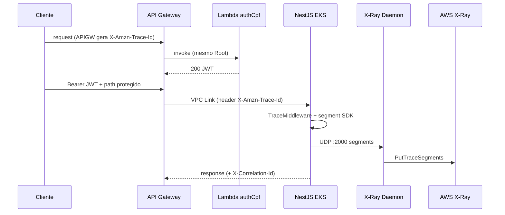

# Tracing — CloudWatch Logs + X-Ray

| Campo | Valor |
|-------|-------|
| Role | `observability` |
| Todo | `observability` |
| Data | 2026-08-09 |
| App | `TraceMiddleware`, `JsonLogger`, `xray.bootstrap` |
| Cluster | [`k8s/xray-daemonset.yaml`](../../k8s/xray-daemonset.yaml) |
| Addon | `amazon-cloudwatch-observability` (Fluent Bit → Logs) |

## Fluxo ponta a ponta



## Componentes

| Camada | Comportamento |
|--------|----------------|
| API Gateway | Gera/propaga `X-Amzn-Trace-Id`; access logs em `/aws/apigateway/...` |
| Lambda | Tracing ativo (`tracing_config Mode=Active` em `lambda.tf`) + permissões X-Ray |
| NestJS | `AWS_XRAY_ENABLED=true`; `AWS_XRAY_DAEMON_ADDRESS=$(HOST_IP):2000` |
| Daemon X-Ray | Preferir **addon** `amazon-cloudwatch-observability` (hostPort 2000). Evitar `k8s/xray-daemonset.yaml` em paralelo — conflito de porta e scale-out de nodes |
| Logs | Fluent Bit (addon) → `/aws/containerinsights/<cluster>/application` JSON |

## Headers

| Header | Origem | Uso |
|--------|--------|-----|
| `X-Amzn-Trace-Id` | APIGW / clientes | Root/Parent do X-Ray; propagado na response se presente |
| `X-Correlation-Id` | App (`TraceMiddleware`) | ALS + campo `correlationId` em todo log JSON |

`JsonLogger` também emite `xrayTraceId` (Root extraído) para join Logs ↔ X-Ray.

## Deploy no cluster

Ordem sugerida (namespace `autoservice`):

```bash
kubectl apply -f k8s/namespace.yaml
# X-Ray: addon CloudWatch Observability (não aplicar xray-daemonset.yaml junto)
kubectl apply -f k8s/serviceaccount-api.yaml   # role-arn = terraform output app_irsa_role_arn
kubectl apply -f k8s/configmap.yaml
kubectl apply -f k8s/api-deployment.yaml
```

Smoke (F9 do plano):

1. `POST /auth/cpf` → anotar `X-Amzn-Trace-Id` / Root.  
2. Chamada autenticada a `/clientes/...`.  
3. X-Ray console: service map APIGW → Lambda e APIGW → `autoservice-api`.  
4. Logs Insights: `filter correlationId = "..."` ou `xrayTraceId = "1-..."`.

## Privacidade (T4)

Não logar Bearer token, CPF completo nem corpo de auth. Preferir `sub` mascarado / hash; `correlationId` é opaco.

## Riscos abertos

| Risco | Mitigação |
|-------|-----------|
| R4 — perda de correlação no VPC Link | Middleware + teste F9; CORS permite header |
| Daemon sem hostPort em CNI estrito | DaemonSet com hostPort; fallback documentar ADOT |
| Thresholds frios | Calibrar após baseline homolog |

## Handoff

- **next_role:** `qa` (ou `docs-arch` no plano Fase 3)  
- **goal:** Validar release com cobertura funcional + smoke observabilidade  
- **artifacts:** este arquivo + [dashboards.md](./dashboards.md) + [alerts.md](./alerts.md)  
