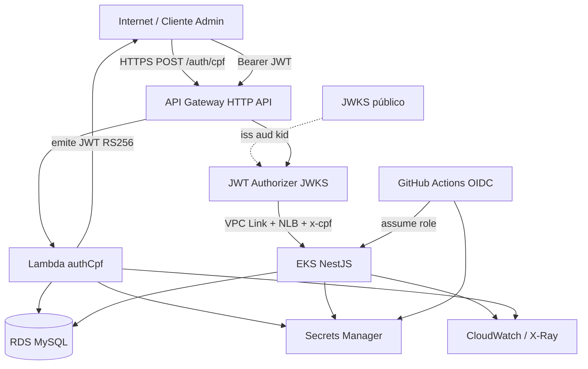

# Threat Model — AutoServiceManager (Fase 3)

| Campo | Valor |
|-------|-------|
| Role | `security` (`.agents/skills/role-security`) |
| Método | STRIDE-lite |
| Escopo | Novas fronteiras Fase 3 (API Gateway, Lambda `authCpf`, JWKS, VPC Link/NLB, OIDC CI, fim do Mongo) |
| Baseline | [SECURITY.md](./SECURITY.md), [solution-design-fase3.md](../architecture/solution-design-fase3.md), ADR-007…010 |
| Data | 2026-09-02 |
| Gate | `gate-security-review` (revalidado pós hardening entrega/deploy) |

## Scope and assets

| Asset | Classificação | Notas |
|-------|---------------|-------|
| CPF do cliente (`sub` JWT / header `x-cpf`) | PII | Identificador de autenticação; minimizar em logs |
| JWT RS256 (cliente) + chave privada | Segredo / token | Privada só em Secrets Manager; pública via JWKS |
| JWT HS256 admin (`JWT_SECRET`) | Segredo | Somente rotas `/admin/*` no Nest |
| Credenciais RDS / `DATABASE_URL` | Segredo | Secrets Manager; SG privado |
| Webhook secret (`WEBHOOK_SECRET`) | Segredo | Integração máquina; fora do Authorizer |
| Ordens de serviço / status | Dados de negócio | MySQL; trilha de audit em CloudWatch (ADR-010) |
| State Terraform + lock | Segredo tier-0 / IaC | S3 + DynamoDB; contém senha RDS; bucket policy least-privilege (ADR-008) |
| OIDC trust GitHub → IAM | Controle de deploy | Sem AKIA; PR sem assume-role no infra-db (ADR-009) |
| Imagem container / Job migrate | Runtime | uid 10001, `readOnlyRootFilesystem` |

**Fora de escopo deste modelo:** UI Next.js (API-only MVP), IdP externo (Cognito), MFA cliente.

## Trust boundaries

| Boundary | Confiança | Controles |
|----------|-----------|-----------|
| Internet → API Gateway | Não confiável | TLS; throttle no edge; `/auth/cpf` rate-limit |
| API Gateway → Lambda | AWS | Invoke sync; timeout curto; sem PII extra no event |
| API Gateway → EKS | **Só tráfego do VPC Link** | NLB interno; SG; nunca expor NLB público |
| EKS / Lambda → RDS | Privado | TLS; SG; credenciais Secrets Manager |
| Authorizer → App | Headers `x-cpf` / `x-scope` | App **não** revalida assinatura JWT cliente; confia só se originado do gateway |
| Admin → Nest JWT HS256 | Fase 2 | `JwtAuthGuard` + `RolesGuard` |
| CI → AWS | OIDC | Trust por `repo`/`sub`; PR infra-db só validate; state keys por ambiente |

## Top threats and mitigations

| ID | STRIDE | Ameaça | Impacto | Mitigação | Residual |
|----|--------|--------|---------|-----------|----------|
| T1 | Spoofing | Forjar header `x-cpf` / `x-scope` se NLB ou app forem alcançáveis fora do VPC Link | Alto | NLB interno + SG VPC Link→nodes; APIGW injeta `x-gateway-verified: 1`; Nest fail-closed com `REQUIRE_GATEWAY_HEADERS=true` em production | Baixo após smoke via APIGW |
| T2 | Spoofing / Elevation | Emitir JWT cliente sem cliente válido ou com CPF malformado | Alto | Lambda usa `@dinhogt/domain-shared`; SELECT parametrizado; claims mínimas; Authorizer exige `iss`/`aud`/exp | Baixo |
| T3 | Tampering | Comprometer chave privada RS256 ou JWKS | Alto | Privada em Secrets Manager; JWKS estático versionado; rotação com 2 `kid` ativos (ADR-007) | Médio (processo de rotação) |
| T4 | Information disclosure | CPF/token em logs CloudWatch ou X-Ray | Médio | `JsonLogger` redact de password/token/authorization/cpf; Noop audit Mongo removido (ADR-010) | Baixo |
| T5 | Elevation / Tampering | Deploy não autorizado via CI (AKIA vazada, OIDC em PR, ou leitura de tfstate) | Alto | OIDC only (ADR-009); job **`security-gate`** bloqueia CD/plan-apply; PR infra sem AWS; `plan→apply tfplan` | Baixo (trust IAM na conta ainda ops) |
| T6 | Denial of service | Flood em `POST /auth/cpf` ou `POST /ordens-servico` | Médio | Throttling API Gateway + Nest Throttler (10/min em OS pública); alarme p95 auth | Médio (ambiente acadêmico) |
| T7 | Tampering | Job migrate / container root / FS gravável | Médio | uid 10001; `readOnlyRootFilesystem`; migrate só no Job com SA sem token API | Baixo |
| T8 | Spoofing | Webhook com `X-Webhook-Secret` fraco ou ausente | Médio | Secret ≥ 16 chars (Joi); `timingSafeEqual`; valores demo bloqueados em production | Baixo |
| T9 | Information disclosure | Swagger/CORS permissivos em production | Médio | Swagger off (`SWAGGER_ENABLED=false`); `CORS_ORIGIN` allowlist obrigatório em production | Baixo |

Máximo operacional OPC: ameaças **T1–T5** são as críticas para o gate; T6–T8 acompanham implementação.

## Residual risks

1. **T1 ops** — Smoke de rede em homolog: confirmar NLB inacessível externamente; rotas CLIENTE só via APIGW.
2. **AUDIT-002** — Residual prod: **1 Low** `body-parser`. Triagem em [controls-matrix.md](./controls-matrix.md).
3. **T5 ops** — Trust policy OIDC (`sub`/branch) manual na conta AWS; ver [hardening-infra-db.md](./hardening-infra-db.md).

## Gate criteria (`gate-security-review`)

| Critério | Status |
|----------|--------|
| Threat model documentado para o escopo alterado | **PASS** (este arquivo) |
| Controles ASVS aplicáveis listados | **PASS** → [controls-matrix.md](./controls-matrix.md) |
| Sem secrets no diff do repositório | **PASS** (`scripts/security-gate.sh`; `.env` gitignored) |
| Job `security-gate` no CI antes de CD/plan-apply | **PASS** → `.github/workflows/security-gate.yml` |
| Smoke pós-deploy documentado | **PASS** → [runbook-deploy-eks.md](../runbook-deploy-eks.md), `scripts/security-smoke.sh` |

**Decisão do gate:** **PASS** para entrega/deploy AWS (homolog/production), com riscos residuais limitados a 3 itens ops.
