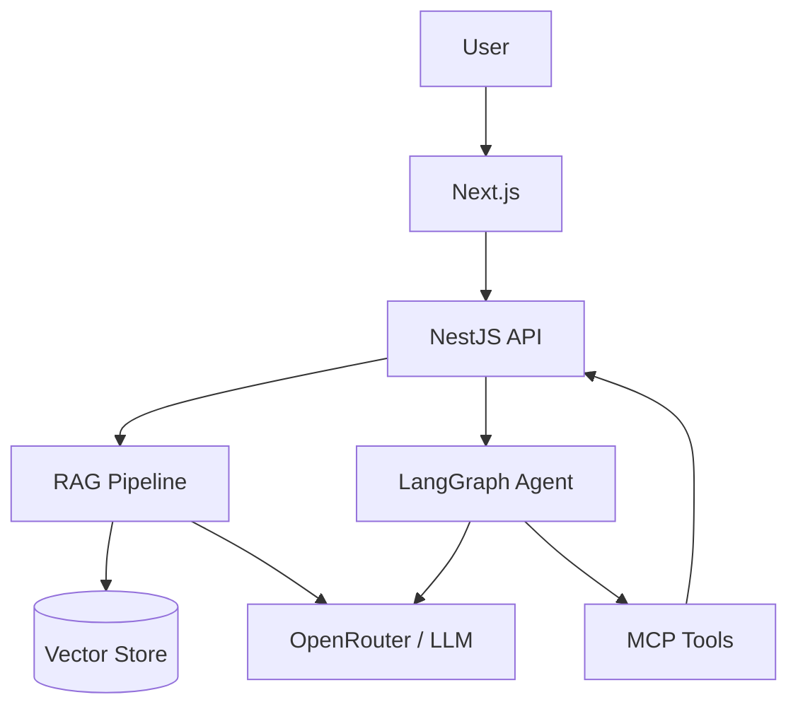

# AI Product Architecture

Reference for products with `ai_features_enabled: true`.

## Architecture overview



## Components

| Layer | Technology | Purpose |
|-------|------------|---------|
| Inference | OpenRouter, OpenAI, Anthropic, Gemini | LLM calls with fallback |
| Orchestration | LangGraph | Multi-step agents, state machines |
| RAG | LangChain + pgvector or Pinecone | Document retrieval |
| Tools | MCP | External tool integration |
| Eval | Custom eval suite in CI | Regression on prompts/responses |
| Guardrails | Input/output filters, PII redaction | Safety and compliance |

## NestJS AiModule structure

```
apps/api/src/ai/
  rag/
    rag.service.ts
    embedding.service.ts
  agents/
    support.agent.ts
  eval/
    eval.runner.ts
  guardrails/
    pii.filter.ts
```

## Cost model (OPC)

Document in `docs/ai/llm-cost-estimate.md`:

| Tier | Users | Est. tokens/user/month | Est. cost |
|------|-------|------------------------|-----------|
| MVP | 100 | 50K | $5–50 |
| Growth | 1K | 50K | $50–500 |
| Scale | 10K | 30K (optimized) | $300–3K |

## LLMOps checklist

- [ ] Prompt versioning in repo
- [ ] Eval dataset for critical flows
- [ ] Fallback model configured
- [ ] Rate limits per tenant
- [ ] No PII in logs or training data
- [ ] Human review for high-risk outputs

## Cloud placement

- **OCI:** API + app hosting
- **GCP Vertex AI:** Optional for fine-tuning, batch inference
- See `gcp-analytics-ai.md`

Owner role: `ai-engineering`. Gate: `gate-ai-architecture`.
