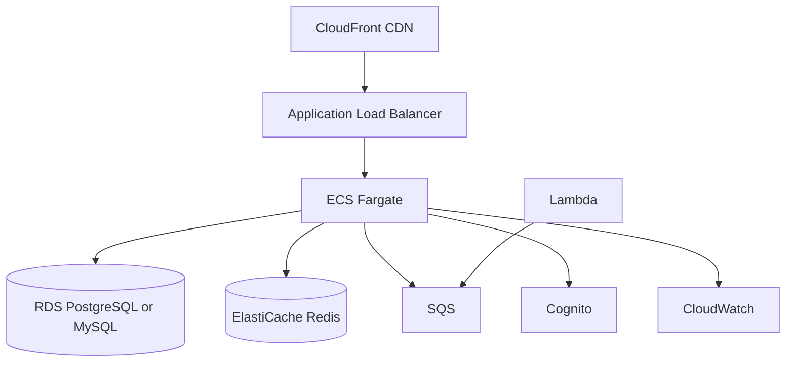

# AWS Scale-up Architecture

Optional cloud for enterprise readiness and scale beyond OCI bootstrap.

## Target scale

- **1,000–100,000 users**
- **Est. cost:** $200–20K/month depending on tier

## Architecture

## Service mapping

| Need | AWS Service |
|------|-------------|
| Compute | ECS Fargate or EKS |
| Database | RDS MySQL/PostgreSQL |
| Cache | ElastiCache Redis |
| CDN | CloudFront |
| Auth | Cognito (or keep app-level OAuth) |
| Async | SQS + Lambda or ECS workers |
| API edge | API Gateway (optional) |
| Events | EventBridge |
| Secrets | Secrets Manager |

## When to adopt

- OCI limits or customer requires AWS
- Need Cognito, advanced WAF, enterprise SLAs
- Multi-region requirement

## OPC operability

- Use Terraform modules; one person can operate with GitHub Actions
- Prefer ECS Fargate over EKS until 10K+ users (lower ops burden)
