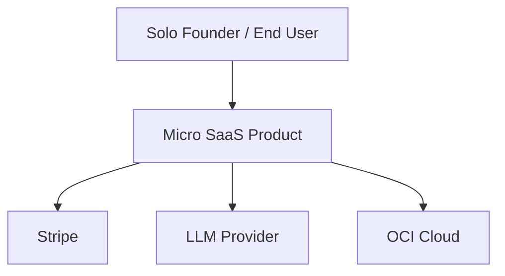
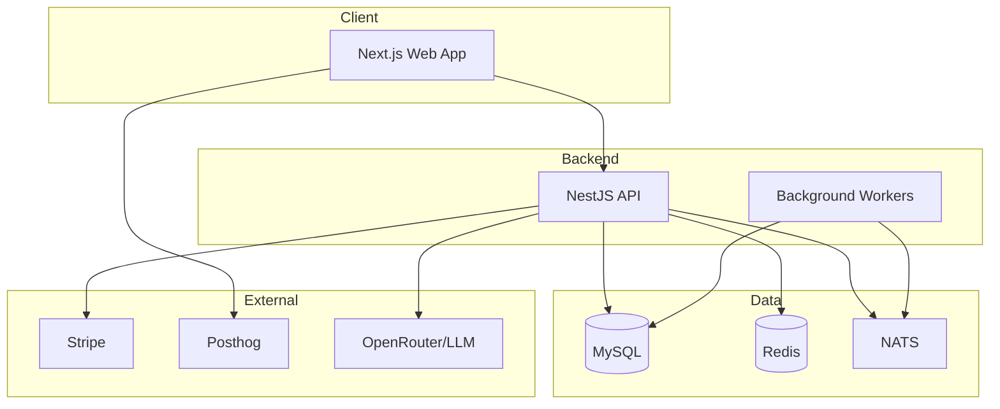

# C4 Reference — Micro SaaS OPC

## Context diagram

## Container diagram

## Component diagram (NestJS API)

| Component | Responsibility |
|-----------|----------------|
| AuthModule | OAuth2/OIDC, JWT, RBAC |
| TenantModule | Multi-tenant context, isolation |
| BillingModule | Stripe webhooks, subscriptions |
| CoreModule | Domain logic |
| EventsModule | NATS publish/subscribe |
| AiModule | RAG, agents (optional) |

## OPC notes

- Start as modular monolith in `apps/api/`
- Extract services only at 10K+ users or clear boundary pain
- See `multi-tenant-saas.md` for tenant patterns
