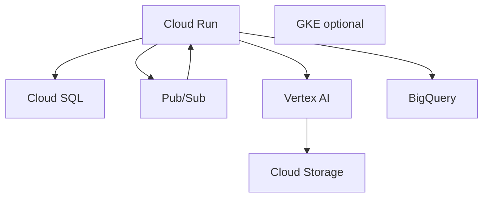

# GCP Analytics and AI Architecture

Optional cloud for AI-heavy products and data analytics.

## Target use cases

- AI products requiring Vertex AI
- Data products with BigQuery analytics
- Pub/Sub event pipelines at scale

## Architecture

## Service mapping

| Need | GCP Service |
|------|-------------|
| Compute | Cloud Run (serverless) or GKE |
| Database | Cloud SQL MySQL/PostgreSQL |
| Messaging | Pub/Sub |
| AI/ML | Vertex AI, Gemini API |
| Analytics | BigQuery |
| Storage | Cloud Storage |

## When to adopt

- Product core is AI/ML (RAG at scale, fine-tuning)
- Heavy analytics and cohort reporting
- Already on GCP for data team

## OPC notes

- Cloud Run minimizes ops for solo founder
- Use when `ai_features_enabled: true` and LLM costs justify GCP integration
- Hybrid: app on OCI, AI batch jobs on GCP via API

See `ai-product-architecture.md`.
