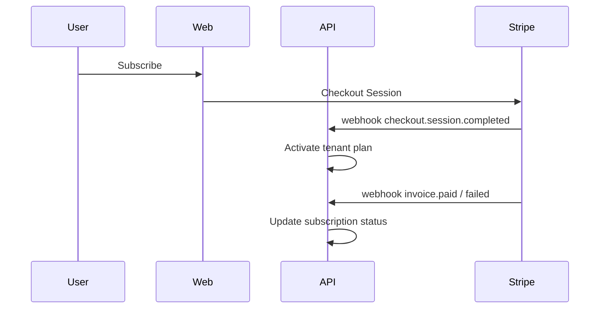

# Multi-Tenant SaaS Architecture

Reference patterns for NestJS + Prisma + MySQL.

## Isolation strategies

| Pattern | Isolation | Complexity | OPC fit |
|---------|-----------|------------|---------|
| Shared DB + tenant_id | Row-level | Low | MVP default |
| Schema per tenant | Schema-level | Medium | 1K+ tenants |
| DB per tenant | Full | High | Enterprise/regulated |

**OPC recommendation:** Start with shared DB + `tenant_id`; migrate to schema-per-tenant at 500+ tenants if needed.

## Data model (Prisma)

```prisma
model Tenant {
  id        String   @id @default(cuid())
  name      String
  stripeCustomerId String?
  users     User[]
  createdAt DateTime @default(now())
}

model User {
  id       String @id @default(cuid())
  tenantId String
  tenant   Tenant @relation(fields: [tenantId], references: [id])
  email    String
  role     Role   @default(MEMBER)
  @@unique([tenantId, email])
}
```

## NestJS tenant context

- Middleware extracts `tenantId` from JWT or subdomain
- Prisma middleware or repository filter enforces `tenantId` on all queries
- Never trust client-provided tenant ID without auth validation

## Billing hooks (Stripe)



## Feature flags

- Posthog feature flags per tenant or plan tier
- Enforce limits in API (rate limits, seat count)

## Security

- RBAC: OWNER, ADMIN, MEMBER per tenant
- Audit log for cross-tenant access attempts
- Threat model must include tenant isolation in scope

## Scale path

| Users | Pattern |
|-------|---------|
| 100 | Shared DB, single region OCI |
| 1K | Redis cache, read replica |
| 10K | Schema-per-tenant or sharding evaluation |
| 100K | Dedicated infra tier; consider AWS |

Owner role for live billing ops: `saas-ops`.
