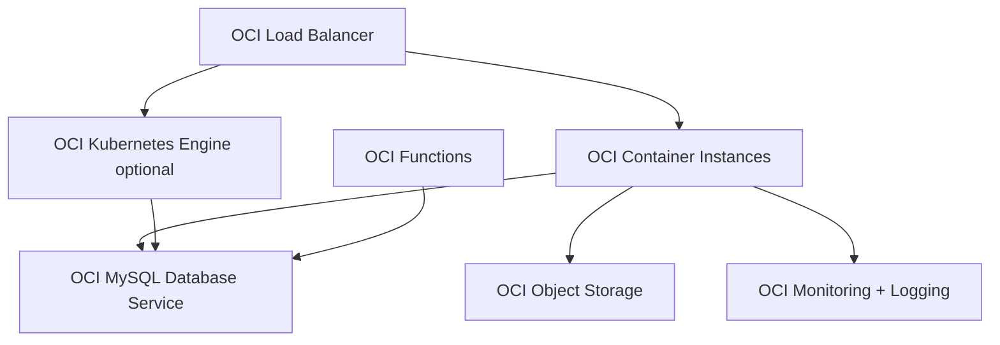

# OCI Bootstrap Architecture — Micro SaaS MVP

Default cloud for OPC when `cloud_preference: oci-first`.

## Target scale

- **100–1,000 users:** MVP and early growth
- **Est. cost:** $50–800/month

## Architecture

## Service mapping

| Component | OCI Service | Notes |
|-----------|-------------|-------|
| Web + API | Container Instances or OKE | CI for MVP; OKE at 1K+ |
| Database | MySQL Database Service | Managed, backups |
| Cache | Redis on Compute or OCI Cache | Sessions, rate limits |
| Static assets | Object Storage + CDN | Next.js static export or assets |
| Background jobs | Functions or worker container | Webhooks, emails |
| Secrets | OCI Vault | No secrets in repo |
| CI/CD | GitHub Actions → OCI Registry | Push images, deploy |
| Monitoring | OCI Monitoring, Logging, Alarms | Critical path alerts |

## Bootstrap checklist

- [ ] VCN with public/private subnets
- [ ] Container Instance for NestJS + Next.js (or separate)
- [ ] Managed MySQL with backup policy
- [ ] Object Storage bucket for uploads
- [ ] Load Balancer with TLS cert
- [ ] IAM policies least-privilege
- [ ] Monitoring alarms on CPU, memory, DB connections

## Migration trigger to AWS

- Enterprise customers requiring AWS compliance
- Need for managed services not on OCI (Cognito, advanced CDN)
- 10K+ users with OCI autoscaling limits hit

See `aws-scale-up.md`.
